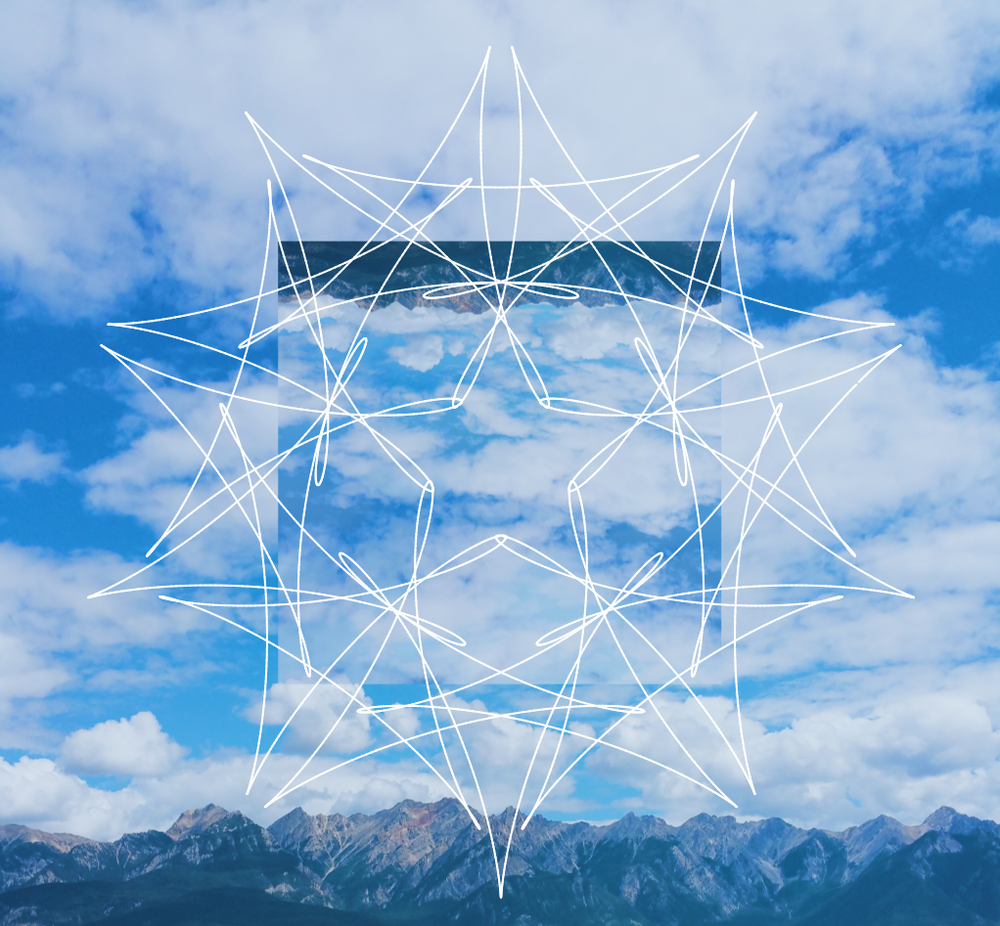

# Symmetry

## Art piece created by Jackie Luc

___
*Symmetry* is a visual art project that I created using HTML, CSS, and Javascript - primarily using the Javascript library [p5.js](http://p5js.org/). My goal with this project was to explore a new technology that can assist in creating a visually appealing art piece that could be showcased on the web. I was largely inspired by how the laws of nature can create such beautiful symmetric structures and wanted to shed some light on Mathematics as not being an entirely "boring" field as they think it is. The project received overwhelmingly positive responses from various non-technical, technical, art, and design students!
___
### Please visit [my website](http://jackieluc.com/netart) to view this art piece!

___
### Controls
* Press **1** to go to the previous image
* Press **2** to go to the next image
* Press **CTRL** to enable or disable sandbox mode
    * If sandbox mode is enabled
        * Press **Up Arrow** to increase the drawing's size  
        * Press **Down Arrow** to decrease the drawing's size
        * Press **Right Arrow** to go to the next drawing
        * Press **Left Arrow** to go to the previous drawing
___

**Inspiration for this project can be found at [How to Create Art with Mathematics](https://www.quantamagazine.org/20151008-symmetry-math-curves-puzzle/).**
